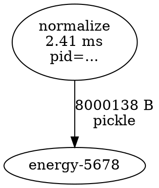

# Implement a library to collect data-flow graph with memory transfer for process-level parallelism

## Коротко

В этом треке программу представляют как data-flow graph: узлы выполняют вычисления, а рёбра показывают, какие данные переходят от производителя к потребителю. Для многопроцессного исполнения важно видеть не только зависимости, но и стоимость сериализации и передачи данных между адресными пространствами.

Вводный практикум: создать маленькую Python-библиотеку, которая исполняет pipeline через несколько процессов и сохраняет JSON/DOT-граф с временем узлов и оценкой объёма переданных данных.

Нужны Python 3.10+ и базовое понимание функций, списков и словарей.

## Маршрут и время

| Уровень | Что выполнить | Оценка времени |
|---|---|---:|
| `MUST` | шаги 1–3 и один `execute_task` через `ProcessPoolExecutor`; вывести `TaskEvent` | 2–3 часа |
| `SHOULD` | шаги 4–6: `TraceSession`, ветвящийся pipeline и DOT | 2–3 часа |
| `CAN` | шаги 7–8 и shared memory: валидация DAG и transfer experiment | от 2 часов |

Для выбора трека достаточно `MUST`. Полная библиотека и визуализация не входят в минимальную пробу.

Оценка времени включает чтение, создание проекта и обычную загрузку зависимостей. Она не включает длительный ремонт системного compiler/driver/runtime: если окружение блокирует вас дольше 30 минут, сохраните точную ошибку и используйте описанный ниже troubleshooting или fallback.

## Результат обучения

> Для обязательного маршрута не нужен starter repository или готовое решение: все создаваемые файлы, ожидаемые результаты и способы диагностики описаны здесь. Внешние ссылки нужны только для загрузки перечисленных инструментов и углубления теории.
>
> Команды приведены для Bash в Linux/macOS. В Windows активируйте окружение командой `.\.venv\Scripts\Activate.ps1`. Везде используется `spawn`, поэтому основной сценарий одинаков для всех ОС.

После практикума вы сможете:

- объяснить различия между data-flow graph, control-flow graph и call graph;
- представить зависимости вычислений как DAG;
- увидеть потенциальный task parallelism по независимым ветвям;
- объяснить, почему Python processes не разделяют обычные объекты;
- собрать trace с PID, временем и размером payload;
- отличить размер сериализованного объекта от фактического трафика ОС.

## Подробная вводная и логика практикума

Параллельную программу трудно анализировать только по исходному коду: функция может быть короткой, но данные между процессами — огромными. Data-flow trace делает исполнение наблюдаемым. Он отвечает, какая задача произвела значение, кто его потребил, в каком процессе выполнялась работа, сколько она длилась и какого порядка был сериализованный payload.

В рассматриваемом pipeline есть два связанных слоя:

```text
логика:     source → normalize ─┬→ mean   ─┐
                               └→ energy ─┴→ report

исполнение: parent process
               → serialize/send
             worker process → compute → serialize/return
```

Первый слой показывает зависимости и потенциальный параллелизм. Второй показывает цену реализации этих зависимостей через процессы. Независимость `mean` и `energy` ещё не означает ускорение: обе ветви могут повторно получить большой нормализованный массив. Поэтому библиотека собирает события узлов и рёбра передачи в одной модели, но честно называет размер `estimated_serialized_bytes`, а не «реальным трафиком памяти».

Обязательная часть начинается не с общего scheduler, а с одной функции `execute_task`. Она создаёт минимальный достоверный event вокруг реального вызова в worker process. Затем `TraceSession` собирает события, demo создаёт ветвящийся DAG, а DOT делает зависимости видимыми. Shared memory оставлена на расширение, потому что оптимизировать передачу имеет смысл после того, как trace показал её потенциальную значимость.

| Этап практикума | Новый уровень наблюдаемости | Зачем он нужен |
|---|---|---|
| Шаги 1–2 | Стабильная схема `TaskEvent` и `EdgeEvent` | Без формата разные запуски нельзя сравнивать |
| Шаг 3 | Один измеренный вызов в отдельном процессе | Проверяет PID, timestamps, result и оценку payload |
| Шаг 4 | Сессия, которая собирает целый запуск | Отдельные события превращаются в trace |
| Шаг 5 | Реальный ветвящийся pipeline | На графе появляется потенциальный task parallelism |
| Шаг 6 | DOT-представление зависимостей | Ошибочные или пропущенные рёбра видны человеку |
| Шаг 7 | Проверка DAG и producer/consumer invariants | Trace становится пригодным для автоматического анализа |
| Шаг 8 | Сравнение обычной передачи и shared memory | Гипотеза о стоимости рёбер проверяется экспериментом |

Итог — не profiler операционной системы, а понятный instrumentation layer с явно ограниченной точностью измерений. Это правильная отправная точка для дальнейшего исследования process-level parallelism.

## Теория с нуля

### Что такое data-flow graph

В data-flow graph узел означает операцию, а направленное ребро — значение, произведённое одной операцией и потреблённое другой.

```text
              ┌→ mean ───┐
source → normalize         → report
              └→ energy ─┘
```

`mean` и `energy` зависят от `normalize`, но не друг от друга. Значит, после готовности нормализованных данных их можно исполнять параллельно.

Если граф не содержит циклов, это DAG — directed acyclic graph. Топологический порядок перечисляет узлы так, что каждый producer находится раньше consumer.

### Не путайте три графа

- Control-flow graph описывает возможный порядок basic blocks внутри программы: ветвления и циклы.
- Call graph показывает, какие функции могут вызывать другие функции.
- Data-flow graph показывает происхождение и потребление значений.

Они могут описывать одну программу, но отвечают на разные вопросы.

### Почему процессы меняют стоимость рёбер

У каждого процесса своё адресное пространство. Аргумент, переданный в другой Python process через `ProcessPoolExecutor`, должен быть сериализуемым. Обычный путь использует pickle и межпроцессный канал. Получатель создаёт собственный объект.

Большой массив, который расходится в две ветви, может быть сериализован и передан дважды. Поэтому ускорение параллельных узлов иногда проигрывается на рёбрах.

`multiprocessing.shared_memory` позволяет нескольким процессам обращаться к одному блоку памяти. Тогда вместо всех данных можно передавать имя блока, shape и dtype. Это уменьшает копирование, но добавляет управление жизненным циклом и синхронизацию.

### Что именно измеряет trace

Минимальный trace узла:

```json
{
  "id": "energy-1",
  "name": "energy",
  "pid": 12345,
  "start_ns": 100,
  "end_ns": 300,
  "input_bytes_estimate": 8000138,
  "output_bytes_estimate": 21
}
```

Для учебной оценки можно использовать `len(pickle.dumps(value, protocol=5))`. Это размер сериализованного representation, а не доказанный объём системных вызовов или физического трафика памяти. Поле и отчёт должны честно называться `estimated_serialized_bytes`.

### Переход от теории к практике

Начните с контракта события: какие поля нужны, в каких единицах они измеряются и что именно означают. Затем оберните одну задачу и убедитесь, что она действительно исполнилась в другом PID. Только после этого собирайте несколько событий в сессию и соединяйте их рёбрами. Визуализация завершает проверку модели, а не заменяет её.

На каждом шаге разделяйте факт и оценку. PID и timestamps возвращены runtime; размер pickle — лишь proxy. Такая маркировка не ослабляет исследование, а делает выводы воспроизводимыми и защищает от ложной точности.

## Практическое задание

### Шаг 1 `[MUST]`. Создайте проект

```text
dftrace-probe/
├── src/dftrace.py
├── src/demo_pipeline.py
├── tests/test_dftrace.py
└── results/
```

Окружение:

```bash
python3 -m venv .venv
source .venv/bin/activate
python -m pip install --upgrade pip
python -m pip install pytest
```

Обязательная часть использует только стандартную библиотеку и pytest.

### Шаг 2 `[MUST]`. Определите формат данных

В `src/dftrace.py` создайте dataclasses:

```python
from dataclasses import asdict, dataclass
from typing import Any


@dataclass(frozen=True)
class TaskEvent:
    id: str
    name: str
    pid: int
    start_ns: int
    end_ns: int
    input_bytes_estimate: int
    output_bytes_estimate: int


@dataclass(frozen=True)
class EdgeEvent:
    source: str
    target: str
    transfer: str
    estimated_serialized_bytes: int


@dataclass(frozen=True)
class TaskResult:
    task: TaskEvent
    value: Any
```

JSON верхнего уровня:

```json
{
  "schema_version": 1,
  "clock": "perf_counter_ns",
  "nodes": [],
  "edges": [],
  "limitations": [
    "serialized sizes are estimates, not measured OS traffic"
  ]
}
```

Версия schema обязательна: иначе будущие изменения полей сломают старые анализаторы молча.

### Шаг 3 `[MUST]`. Реализуйте worker wrapper

Функция должна находиться на верхнем уровне модуля, чтобы её можно было сериализовать при start method `spawn`:

```python
import os
import pickle
import time
import uuid
from collections.abc import Callable
from typing import Any


def estimate_size(value: Any) -> int:
    return len(pickle.dumps(value, protocol=5))


def execute_task(name: str, function: Callable[[Any], Any], value: Any) -> TaskResult:
    task_id = f"{name}-{uuid.uuid4().hex[:8]}"
    input_size = estimate_size(value)
    start = time.perf_counter_ns()
    output = function(value)
    end = time.perf_counter_ns()
    event = TaskEvent(
        id=task_id,
        name=name,
        pid=os.getpid(),
        start_ns=start,
        end_ns=end,
        input_bytes_estimate=input_size,
        output_bytes_estimate=estimate_size(output),
    )
    return TaskResult(event, output)
```

Для production-трассировки UUID и pickle-size могут быть слишком дорогими. Здесь они дают прозрачную эталонную реализацию.

Для завершения `MUST` создайте `src/demo_minimal.py`:

```python
import multiprocessing as mp
import os
from concurrent.futures import ProcessPoolExecutor

from src.dftrace import execute_task


def square(values: list[int]) -> list[int]:
    return [value * value for value in values]


def main() -> None:
    context = mp.get_context("spawn")
    with ProcessPoolExecutor(max_workers=1, mp_context=context) as executor:
        result = executor.submit(
            execute_task, "square", square, [1, 2, 3]
        ).result()
    print(result.task)
    print(result.value)
    assert result.task.pid != os.getpid()
    assert result.value == [1, 4, 9]


if __name__ == "__main__":
    main()
```

Запуск из корня проекта:

```bash
python -m src.demo_minimal
```

Вы должны увидеть `TaskEvent` с именем `square`, PID дочернего процесса, положительными размерами и `[1, 4, 9]`.

### Шаг 4 `[SHOULD]`. Реализуйте `TraceSession`

Класс должен:

- владеть `ProcessPoolExecutor`;
- хранить `nodes` и `edges` только в parent process;
- запускать один узел через `run(name, function, value, source_id)`;
- запускать независимые узлы через `run_parallel(specs, value, source_id)`;
- после каждого `Future.result()` добавлять `TaskEvent`;
- добавлять edge от `source_id` к новому task id;
- сохранять JSON атомарно после успешного завершения;
- закрывать executor даже при исключении.

Используйте явный cross-platform context:

```python
import multiprocessing as mp
from concurrent.futures import ProcessPoolExecutor

context = mp.get_context("spawn")
executor = ProcessPoolExecutor(max_workers=workers, mp_context=context)
```

Не запускайте pipeline при импорте. Точка входа обязана быть защищена:

```python
if __name__ == "__main__":
    main()
```

Иначе `spawn` может рекурсивно создавать процессы.

### Шаг 5 `[SHOULD]`. Создайте demo pipeline

Все task-функции должны быть top-level и детерминированными:

```python
def make_signal(n: int) -> list[float]:
    return [((i * 17) % 101) / 100.0 for i in range(n)]


def normalize(values: list[float]) -> list[float]:
    maximum = max(abs(x) for x in values) or 1.0
    return [x / maximum for x in values]


def mean(values: list[float]) -> float:
    return sum(values) / len(values)


def energy(values: list[float]) -> float:
    return sum(x * x for x in values)


def make_report(stats: tuple[float, float]) -> dict[str, float]:
    average, total_energy = stats
    return {"mean": average, "energy": total_energy}
```

Постройте граф:

1. `make_signal`;
2. `normalize`;
3. параллельно `mean` и `energy`;
4. `make_report`.

Для последнего узла создайте два входных ребра. Убедитесь, что в trace есть разные PID хотя бы для части workers; если executor использовал один процесс из-за коротких задач, увеличьте объём работы, но не подменяйте PID вручную.

### Шаг 6 `[SHOULD]`. Экспортируйте DOT

Добавьте метод `to_dot()`:



Экранируйте имена и не вставляйте пользовательские строки в DOT без обработки. Установка Graphviz для рендера необязательна; текстовый `.dot` является основным артефактом.

### Шаг 7 `[CAN]`. Добавьте проверки графа

Тесты должны проверять:

- `estimate_size` детерминирован для простых значений;
- у каждого узла `end_ns >= start_ns`;
- все `source` и `target` рёбер существуют;
- граф не содержит циклов;
- топологический порядок соблюдает каждое ребро;
- в demo ровно две ветви после `normalize`;
- финальный узел имеет indegree 2;
- exception worker не оставляет executor незакрытым;
- JSON читается обратно и содержит `schema_version`.

Проверку DAG реализуйте самостоятельно через алгоритм Кана: считайте indegree, извлекайте узлы с нулевым indegree и уменьшайте indegree их потомков.

### Шаг 8 `[CAN]`. Исследуйте стоимость передачи

Запустите pipeline для `n = 1_000`, `100_000`, `1_000_000`. Для каждого размера сохраните:

- длительность `normalize`, `mean`, `energy`;
- estimated bytes на каждом edge;
- полное wall-clock время pipeline;
- сумму длительностей узлов;
- critical path estimate.

Ответьте:

1. Какой edge самый дорогой по объёму?
2. Почему выход `normalize` передаётся в две ветви?
3. Почему сумма node durations может быть больше wall time?
4. Почему сумма node durations не включает всю стоимость pipeline?
5. Когда shared memory потенциально полезнее pickle?

### Необязательное продолжение: shared memory

Замените большой `list[float]` на NumPy array в `SharedMemory`. По edge передавайте только `{name, shape, dtype}`. Отдельно считайте logical payload bytes и serialized metadata bytes. Обязательно закройте view во всех процессах и вызовите `unlink()` ровно один раз у владельца.

## Пошаговый программный разбор полной учебной вертикали

Шаг 3 уже даёт минимальный `MUST`. Чтобы студент увидел не список требований, а собираемую библиотеку, ниже приведена полная реализация `TraceSession`, demo и ключевых тестов.

### 1. Дополните `src/dftrace.py`

После `execute_task` добавьте:

```python
import json
import multiprocessing as mp
import os
import tempfile
from concurrent.futures import ProcessPoolExecutor
from pathlib import Path


class TraceSession:
    def __init__(self, workers: int = 2) -> None:
        if workers < 1:
            raise ValueError("workers must be positive")
        context = mp.get_context("spawn")
        self._executor = ProcessPoolExecutor(
            max_workers=workers,
            mp_context=context,
        )
        self.nodes: list[TaskEvent] = []
        self.edges: list[EdgeEvent] = []
        self._closed = False

    def __enter__(self) -> "TraceSession":
        return self

    def __exit__(self, exc_type, exc_value, traceback) -> None:
        self.close()

    def close(self) -> None:
        if not self._closed:
            self._executor.shutdown(wait=True, cancel_futures=True)
            self._closed = True

    def _ensure_open(self) -> None:
        if self._closed:
            raise RuntimeError("trace session is closed")

    def _record(
        self,
        result: TaskResult,
        inputs: list[tuple[str, Any]],
    ) -> tuple[str, Any]:
        self.nodes.append(result.task)
        for source_id, value in inputs:
            self.edges.append(EdgeEvent(
                source=source_id,
                target=result.task.id,
                transfer="pickle",
                estimated_serialized_bytes=estimate_size(value),
            ))
        return result.task.id, result.value

    def run(
        self,
        name: str,
        function: Callable[[Any], Any],
        value: Any,
        source_id: str | None = None,
    ) -> tuple[str, Any]:
        self._ensure_open()
        result = self._executor.submit(
            execute_task, name, function, value
        ).result()
        inputs = [] if source_id is None else [(source_id, value)]
        return self._record(result, inputs)

    def run_parallel(
        self,
        specs: list[tuple[str, Callable[[Any], Any]]],
        value: Any,
        source_id: str,
    ) -> list[tuple[str, Any]]:
        self._ensure_open()
        futures = [
            self._executor.submit(execute_task, name, function, value)
            for name, function in specs
        ]
        return [
            self._record(future.result(), [(source_id, value)])
            for future in futures
        ]

    def run_join(
        self,
        name: str,
        function: Callable[[Any], Any],
        inputs: list[tuple[str, Any]],
    ) -> tuple[str, Any]:
        self._ensure_open()
        joined_value = tuple(value for _, value in inputs)
        result = self._executor.submit(
            execute_task, name, function, joined_value
        ).result()
        return self._record(result, inputs)

    def as_json(self) -> dict[str, Any]:
        return {
            "schema_version": 1,
            "clock": "perf_counter_ns",
            "nodes": [asdict(node) for node in self.nodes],
            "edges": [asdict(edge) for edge in self.edges],
            "limitations": [
                "serialized sizes are estimates, not measured OS traffic"
            ],
        }

    def save_json(self, path: str | Path) -> None:
        destination = Path(path)
        destination.parent.mkdir(parents=True, exist_ok=True)
        with tempfile.NamedTemporaryFile(
            mode="w",
            encoding="utf-8",
            dir=destination.parent,
            delete=False,
        ) as temporary:
            json.dump(self.as_json(), temporary, indent=2)
            temporary.write("\n")
            temporary_name = temporary.name
        os.replace(temporary_name, destination)

    def to_dot(self) -> str:
        def escape(value: str) -> str:
            return value.replace("\\", "\\\\").replace('"', '\\"').replace("\n", "\\n")

        lines = ["digraph dataflow {"]
        for node in self.nodes:
            duration_ms = (node.end_ns - node.start_ns) / 1_000_000
            label = escape(f"{node.name}\n{duration_ms:.3f} ms\npid={node.pid}")
            lines.append(f'  "{escape(node.id)}" [label="{label}"];')
        for edge in self.edges:
            label = escape(
                f"{edge.estimated_serialized_bytes} B\n{edge.transfer}"
            )
            lines.append(
                f'  "{escape(edge.source)}" -> "{escape(edge.target)}" '
                f'[label="{label}"];'
            )
        lines.append("}")
        return "\n".join(lines) + "\n"
```

`run_parallel` сначала создаёт все futures и лишь затем вызывает `result()`. Если submit и ожидание чередовать, ветви выполнятся последовательно. `run_join` получает список пар `(producer_id, value)`, поэтому размер каждого входного ребра считается по своему значению, а не по общему tuple.

### 2. Создайте полный `src/demo_pipeline.py`

```python
from pathlib import Path

from src.dftrace import TraceSession


def make_signal(n: int) -> list[float]:
    return [((index * 17) % 101) / 100.0 for index in range(n)]


def normalize(values: list[float]) -> list[float]:
    maximum = max((abs(value) for value in values), default=0.0) or 1.0
    return [value / maximum for value in values]


def mean(values: list[float]) -> float:
    return sum(values) / len(values)


def energy(values: list[float]) -> float:
    return sum(value * value for value in values)


def make_report(stats: tuple[float, float]) -> dict[str, float]:
    average, total_energy = stats
    return {"mean": average, "energy": total_energy}


def main() -> None:
    with TraceSession(workers=2) as trace:
        source_id, signal = trace.run("source", make_signal, 100_000)
        normalize_id, normalized = trace.run(
            "normalize", normalize, signal, source_id
        )
        branches = trace.run_parallel(
            [("mean", mean), ("energy", energy)],
            normalized,
            normalize_id,
        )
        report_id, report = trace.run_join(
            "report", make_report, branches
        )

        trace.save_json("results/trace.json")
        Path("results/trace.dot").write_text(trace.to_dot())

        print(f"report node: {report_id}")
        print(report)
        print(f"nodes={len(trace.nodes)} edges={len(trace.edges)}")


if __name__ == "__main__":
    main()
```

Ожидается `nodes=5 edges=5`: узлы — `source`, `normalize`, `mean`, `energy`, `report`; рёбра — `source→normalize`, два ребра из `normalize` и два входа в `report`. Сосчитайте их вручную до запуска, затем сверьте с trace.

### 3. Добавьте ключевые тесты

Создайте `tests/test_dftrace.py`:

```python
import json
import os

import pytest

from src.dftrace import TraceSession, estimate_size


def square(values: list[int]) -> list[int]:
    return [value * value for value in values]


def total(values: list[int]) -> int:
    return sum(values)


def test_estimate_size_is_positive_and_repeatable() -> None:
    assert estimate_size([1, 2, 3]) > 0
    assert estimate_size([1, 2, 3]) == estimate_size([1, 2, 3])


def test_one_worker_event_has_real_child_pid() -> None:
    with TraceSession(workers=1) as trace:
        task_id, value = trace.run("square", square, [1, 2, 3])
        event = trace.nodes[0]
        assert task_id == event.id
        assert value == [1, 4, 9]
        assert event.pid != os.getpid()
        assert event.end_ns >= event.start_ns


def test_edge_and_json_are_recorded(tmp_path) -> None:
    with TraceSession(workers=1) as trace:
        first_id, values = trace.run("square", square, [1, 2])
        second_id, value = trace.run("total", total, values, first_id)
        destination = tmp_path / "trace.json"
        trace.save_json(destination)

        assert value == 5
        assert trace.edges[0].source == first_id
        assert trace.edges[0].target == second_id
        payload = json.loads(destination.read_text())
        assert payload["schema_version"] == 1
        assert len(payload["nodes"]) == 2
        assert len(payload["edges"]) == 1


def test_closed_session_rejects_new_work() -> None:
    trace = TraceSession(workers=1)
    trace.close()
    with pytest.raises(RuntimeError, match="closed"):
        trace.run("square", square, [1])
```

Запуск:

```bash
python -m pytest -q
python -m src.demo_pipeline
```

Откройте `results/trace.json` как данные, а `results/trace.dot` — как описание графа. Не исправляйте PID или timing вручную ради красивого файла.

### 4. Порядок чтения кода при отладке

Если worker не запускается, начните с top-level task-функции и защиты `__main__`. Если узел есть, но ребро потеряно, проверяйте `_record`, а не process pool. Если JSON неверен при правильных `nodes`/`edges` в памяти, проверяйте только `as_json` и `save_json`. Такое разделение по слоям — основная инженерная польза структуры библиотеки.

## Контрольные точки и troubleshooting

| После шага | Должно получиться | Если не получилось |
|---|---|---|
| 2 | dataclasses создаются и преобразуются через `asdict` | проверьте импорты и совпадение имён полей с JSON schema |
| 3 | минимальный запуск печатает `[1, 4, 9]` и PID, отличный от parent | проверьте top-level `square`, блок `if __name__ == "__main__"` и start method `spawn` |
| 5 | у `normalize` два outgoing edges, у `report` два incoming | регистрируйте зависимости по producer ID, а не по порядку завершения futures |
| 6 | `.dot` открывается как текст и содержит все nodes/edges | сначала проверьте escaping кавычек и переводов строк; Graphviz renderer необязателен |

Если `Can't pickle local object`, worker-функция или task-функция объявлена внутри другой функции. Перенесите её на уровень модуля. Если child process создаётся рекурсивно, отсутствует защита `if __name__ == "__main__"`.

## Самопроверка

1. Что означает ребро data-flow graph?
2. Почему `pickle.dumps` даёт только оценку transfer size?
3. Почему независимые `mean` и `energy` надо submit-ить до ожидания первого результата?

<details>
<summary>Ответы для самостоятельной сверки</summary>

1. Значение, произведённое source task и необходимое target task.
2. Реальный путь включает framing, IPC protocol, возможные копии и системные buffers, которые размер pickle не измеряет.
3. Ожидание сразу после первого submit сериализует ветви и уничтожает доступный task parallelism.

</details>

## Рубрика самооценки `MUST`

| Критерий | 0 | 1 | 2 |
|---|---|---|---|
| Понимание | путаю типы графов | понимаю node/edge | объясняю dependency, process boundary и transfer estimate |
| Корректность | worker не запускается | получен output | PID, output, timestamps и sizes проверены assertions |
| Воспроизводимость | работает только интерактивно | есть файл | модуль запускается одной командой со `spawn` |
| Ограничения | pickle-size назван трафиком | ограничение упомянуто | различены serialized, logical и physical bytes |

Ориентир готовности: не менее 6/8 и не 0 за корректность.

## Что сдать

- `[MUST]` `dftrace.py`, `demo_minimal.py`, вывод `TaskEvent` и описание ограничений pickle-size;
- `[SHOULD]` `TraceSession`, ветвящийся demo pipeline, JSON и DOT;
- `[CAN]` тесты DAG/schema, таблицу transfer experiment и дизайн shared memory.

## Критерии готовности

Для обязательного маршрута используйте рубрику MUST выше. Пункты ниже описывают полную версию практикума, включая SHOULD/CAN.

- Trace содержит реальные PID и монотонные timestamps.
- Edge связывает producer и consumer, а не просто соседние вызовы.
- Размер честно называется оценкой сериализованного representation.
- Граф проходит проверку DAG и ссылочной целостности.
- Независимые ветви отправляются до ожидания результатов.
- Исключения и завершение executor обработаны.
- Результат воспроизводится при start method `spawn`.

## Подойдёт ли вам этот трек

Да, если вам нравятся runtime systems, наблюдаемость, планирование и вопрос «куда на самом деле ушло время». Здесь код быстро превращается в исследование: точность трассировки, overhead инструмента и модель памяти приходится измерять отдельно.

Дальнейшие темы: zero-copy edges, критический путь, task scheduling, backpressure, трассировка CPU/GPU transfers, schema для распределённого запуска и визуализация больших графов.

## Решение о выборе трека

После MUST поставьте каждому утверждению оценку от 1 («совсем нет») до 5 («полностью да»):

1. Я могу своими словами объяснить, какую задачу решал и зачем.
2. Мне было интересно искать причину ошибки, а не только получить готовый результат.
3. Типичные трудности этого практикума не отбили желание продолжать.
4. Я хочу улучшить решение или проверить его на другом примере.
5. Я могу сформулировать следующий исследовательский вопрос по теме.

Сумма `20–25` — сильный сигнал в пользу трека; `14–19` — сравните со вторым кандидатом; `5–13` — вероятно, другое направление подойдёт лучше. В конце запишите одно честное предложение: «Я выбираю / не выбираю этот трек, потому что …».

## Источники

- [Python: Process-based parallelism](https://docs.python.org/3/library/multiprocessing.html)
- [Python: ProcessPoolExecutor](https://docs.python.org/3/library/concurrent.futures.html#processpoolexecutor)
- [Python: multiprocessing.shared_memory](https://docs.python.org/3/library/multiprocessing.shared_memory.html)
- [Graphviz DOT language](https://graphviz.org/doc/info/lang.html)
